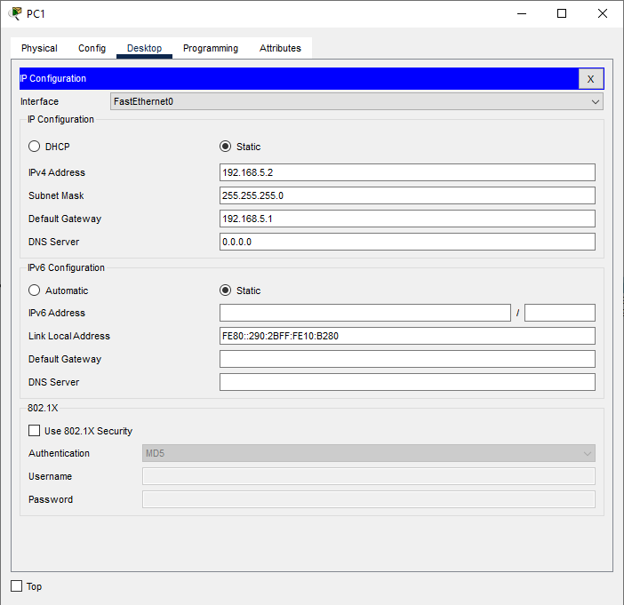
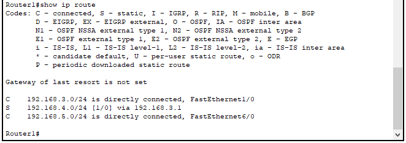
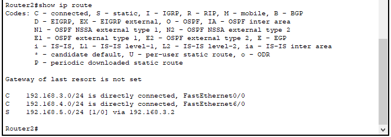
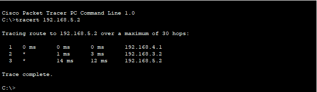
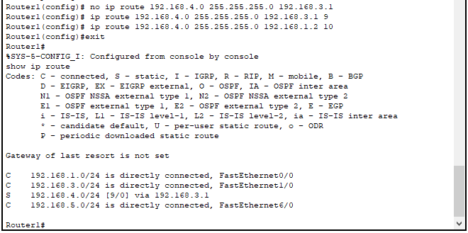
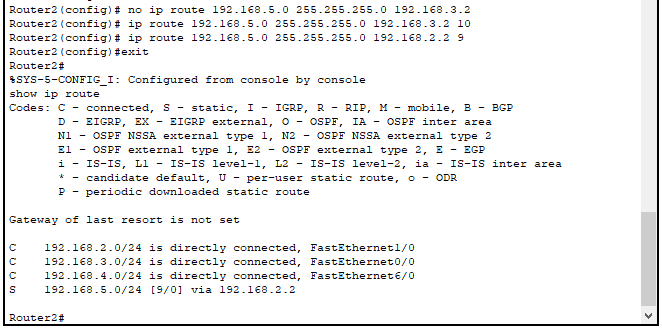
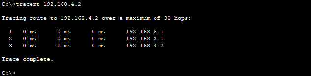

# Laporan Praktikum Konsep Jaringan

## Nama  : Muhammad Latif

## NRP   : 3121600030

## Kelas : 2 D4 Teknik Informatika A

# Praktikum 8

## Topologi

Berikut adalah topologi yang ditentukan.

Dapat dilihat pada topologi diatas terdapat sebuah jaringan bagian kiri yang memiliki ip network 192.168.4.0/24 dan bagian kanan memiliki network 192.168.5.0/24. Akan disiapkan 3 router untuk menghubungkan kedua jaringan tersebut. Dari sini saya akan melakukan 4 percobaan antara lain :

## Percobaan 1: Konfigurasi default

1.  konfigurasi ip dan default gateway pada pc0 dan pc1.

    

    

2.  Beri konfigurasi ip dan hostname pada router1 dan router2, berikut konfigurasinya

    Router1

        hostname Router1
        interface fa0/0
            ip address 192.168.1.1 255.255.255.0
            no shutdown
        interface fa1/0
            ip address 192.168.3.2 255.255.255.0
            no shutdown
        interface 2/0
            ip address 192.168.5.1 255.255.255.0
            no shutdown

    Router2

        hostname Router2
        interface fa0/0
            ip address 192.168.2.1 255.255.255.0
            no shutdown
        interface fa1/0
            ip address 192.168.3.1 255.255.255.0
            no shutdown
        interface fa2/0
            ip address 192.168.4.1 255.255.255.0
            no shutdown

3.  beri juga konfigurasi static dan pada router1 dan router2, karena router tehubung secara langsung sehingga kita dapat langsung mengarahkan ip ke masing masing router. Berikut konfigurasinya

    Router1

        ip route 192.168.4.0 255.255.255.0 192.168.3.1

    Router2

        ip route 192.168.5.0 255.255.255.0 192.168.3.2

4.  Mari kita cek tabel routing setelah melakukan konfigurasi pada kedua router tersebut dengan menggunakan perintah

        show ip route

    

    Router1 memiliki rute menuju jaringan 4.0 melalui gateway 192.168.3.1 dengan distance default yaitu [1/0] atau 1.

    

    Sedangkan Router1 memiliki rute menuju jaringan 5.0 melalui gateway 192.168.3.2 dnegan distance default [1/0] atau 1.

## Percobaan 2: Trace Packet

sesudah melakukan konfigurasi static router, kita dapat melakukan trace packet dari jaringan 4.0 menuju 5.0 dengan memberikan perintah :

        tracert 192.168.5.2

pada cmp PC0

Dari hasil percobaan diatas, packet akan melewati 2 gateway sebelum sampai tujuan, gateway tersebut adalah gateway dari jaringan itu sendiri dan (192.168.4.1) dan ip dari router1 yang terhubung dengan router2 (192.168.3.2). dapat disimpulkan bahwa paket sudah memalui rute yang benar.

## Percobaan 3: Konfigurasi IP dan routing Router0

mari mengkonfigurasi routing0 supaya memiliki routing menuju jaringan 4.0 dan 5.0 dengan memberikan perintah seperti berikut :

    hostname Router0
    ip route 192.168.4.0 255.255.255.0 192.168.2.1
    ip route 192.168.5.0 255.255.255.0 192.168.1.1
    interface fa1/0
        ip address 192.168.1.2 255.255.255.0
        no shutdown
    interface fa0/0
        ip address 192.168.2.2 255.255.255.0
        no shutdown

meri cek tabel routing yang sudah kita buat pad router0

.png)

dari tabel diatas, menunjukkan bahwa konfigurasi pada router0 sudah benar. Mari kita coba untuk melakukan trace paket.

.png)

hasil trace menunjukkan bahwa route yang diambil sama seperti yang sebelumnya, sehingga untuk dapat melewati router0 kita dapat melakukan perubahan matrix yang akan kita lakukan pada percobaan berikutnya.

## Percobaan 4 - Penambahan routing melalui router0

mari kita coba menambahkan route untuk pengiriman packet dari PC0 menuju PC1 melalui router0, sedangkan dari PC1 menuju PC0 tidak melalui router0.

1.  Hapus konfigurasi routing pada Router2 dan Router1

    Router2

         no ip route 192.168.5.0 255.255.255.0 192.168.3.2

    Router1

         no ip route 192.168.4.0 255.255.255.0 192.168.3.1

2.  lakukan konfigurasi routing baru

    Router2

         ip route 192.168.5.0 255.255.255.0 192.168.3.2 10
         ip route 192.168.5.0 255.255.255.0 192.168.2.2 9

    Router1

         ip route 192.168.4.0 255.255.255.0 192.168.3.1 9
         ip route 192.168.4.0 255.255.255.0 192.168.1.2 10

3.  Pengecekan tabel routing

    Router1

    

    Sekarang Router1 memiliki rute menuju jaringan 4.0 melalui gateway 192.168.3.1 dengan distance baru yaitu [9/0] atau 9.

    Router2

    

    Sekarang Router1 memiliki rute baru yang memiliki gateway 192.168.2.2 dan memiliki distance yang baru.

4.  Trace jalur

mari kita lekukan pembuktian konfigurasi yang telah kita buat dengan melakukan trac pada PC0 menuju PC1

.png)

dari gambar diatas, jalur yang dilewati oleh packet telah berubah. gateway yang dilewati bertambah yaitu 192.168.2.2 dan 192.168.3.2.

dari gambar diatas, jalur yang dilewati masih sama seperti percobaan sebelumnya, ini sesuai dengan distance yang telah kita berikan.

## Kesimpulan

Konfigurasi pada distance mempengaruhi jalur yang akan dipilih oleh sebuah packet. Packet cenderung akan memilih jalur distance kecil.